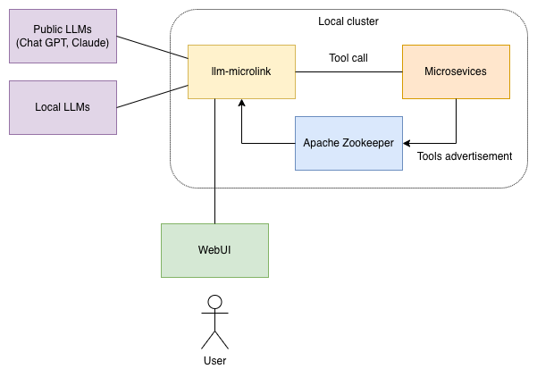
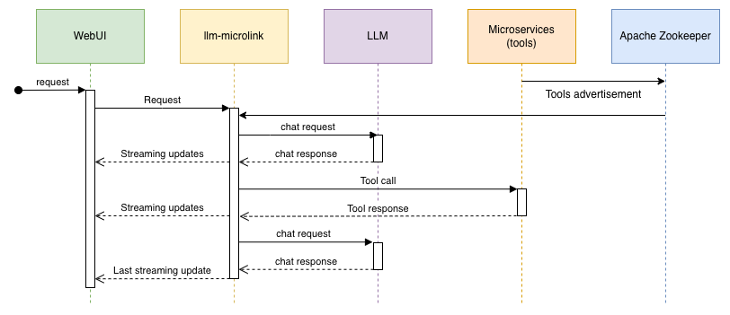

# llm-microlink

Status: early-stage (not production ready)

`llm-microlink` is an LLM proxy that connects [large language models](https://en.wikipedia.org/wiki/Large_language_model) to your [microservice](https://en.wikipedia.org/wiki/Microservices) ecosystem, enabling seamless **tool calling**.
It discovers tools advertised by your microservices, passes them to the LLM, executes tool calls via REST APIs, and feeds results back into the conversation.

The goal is to provide a scalable, enterprise-grade approach to LLM automation within microservice ecosystems.

## Why Not MCP?

This project is not an [MCP](https://modelcontextprotocol.io/) implementation.
It's an alternative approach to LLM tool integration, designed specifically for scalable microservice architectures.
While MCP works well for desktop applications and local integrations, it presents challenges in distributed enterprise environments:

|                        | MCP                                          | llm-microlink                                      |
|------------------------|----------------------------------------------|----------------------------------------------------|
| **Tool Discovery**     | Static configuration                         | Dynamic discovery                                  |
| **High Availability**  | Manual endpoint management                   | Automatic failover across redundant microservices  |
| **Security Model**     | Exposes MCP server to LLM clients            | No inbound connections; tools stay unexposed       |
| **Architecture Fit**   | Client-side integration                      | Server-side proxy pattern                          |

`llm-microlink` embraces the strengths of microservice architecture: service discovery, redundancy, load balancing, and defense in depth - rather than requiring you to work around them.

## Key Features

* **Universal LLM Support**: Connect to local models (vLLM, TensorRT-LLM) or frontier APIs (OpenAI, Anthropic Claude) through a unified interface
* **Tool Discovery**: Microservices advertise their capabilities and `llm-microlink` picks them up automatically
* **Native Tool Calling**: Leverages built-in function calling capabilities of modern LLMs for reliable, structured interactions

## Architecture

Component diagram:

Sequence diagram:

## Built With

* [Python](https://www.python.org) & [ASAB](https://github.com/TeskaLabs/asab) microservice framework

## Tools Discovery

The mechanism of tools discovery is extendible by "providers".
Currently a provider for [Apache Zookeeper](https://en.wikipedia.org/wiki/Apache_ZooKeeper) is available.
It is relatively simple to add more tools discovery providers for other technologies such as `etcd` or Consul.

